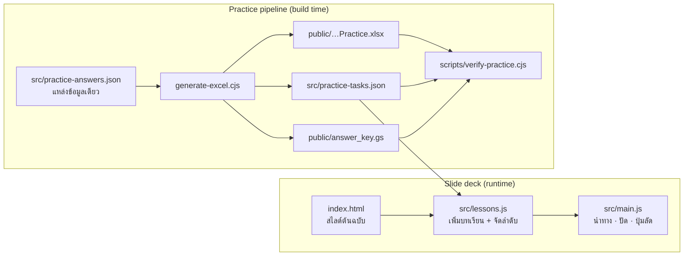

<div align="center">

# Google Sheets: เรียนรู้และลงมือทำด้วยตนเอง

สื่อการสอน Google Sheets แบบเว็บสไลด์สำหรับผู้เริ่มต้นชาวไทย ใช้เรียนเองได้ มีไฟล์แบบฝึกและเฉลยพร้อมคำอธิบาย

[](https://github.com/namkangwaan/google-sheet-slide-html/actions/workflows/deploy-pages.yml)


[](LICENSE)

**[เปิดบทเรียน](https://namkangwaan.github.io/google-sheet-slide-html/)** ·
**[ดาวน์โหลดแบบฝึก (.xlsx)](https://namkangwaan.github.io/google-sheet-slide-html/Google_Sheets_Mastery_Practice.xlsx)** ·
[สารบัญ](https://namkangwaan.github.io/google-sheet-slide-html/#slide-3) ·
[เฉลย 30 ข้อ](https://namkangwaan.github.io/google-sheet-slide-html/#lesson-answers)

</div>

---

## สารบัญ

- [สำหรับผู้เรียน](#สำหรับผู้เรียน-for-learners)
- [สำหรับครู](#สำหรับครู-for-teachers)
- [เนื้อหาหลักสูตร](#เนื้อหาหลักสูตร-curriculum)
- [การใช้งานบนอุปกรณ์ต่าง ๆ](#การใช้งานบนอุปกรณ์ต่าง-ๆ-devices--controls)
- [สำหรับนักพัฒนา](#สำหรับนักพัฒนา-for-developers)
- [สถาปัตยกรรม](#สถาปัตยกรรม-architecture)
- [การ Deploy](#การ-deploy-deployment)
- [ข้อจำกัดที่ทราบ](#ข้อจำกัดที่ทราบ-known-limitations)

---

## สำหรับผู้เรียน (For Learners)

เปิดบทเรียนในแท็บหนึ่ง แล้วลงมือทำใน Google Sheets อีกแท็บหนึ่ง

1. เปิด **[บทเรียน](https://namkangwaan.github.io/google-sheet-slide-html/)** แล้วกด **เริ่มเรียนและเปิดแบบฝึก**
2. ดาวน์โหลด `Google_Sheets_Mastery_Practice.xlsx` อัปโหลดขึ้น Google Drive แล้วเลือก **File → Save as Google Sheets**
3. ตั้ง **File → Settings → Locale: Thailand** และ **Time zone: Bangkok** เพื่อให้วันที่และตัวคั่นสูตรตรงกับตัวอย่าง
4. เรียนตามลำดับ ทำกิจกรรมท้ายหัวข้อ แล้วค่อยเปิดคำใบ้หรือเฉลย

| ระดับ | สำหรับใคร | ชิ้นงานปิดท้าย |
|---|---|---|
| **พื้นฐาน** | ยังไม่เคยเขียนสูตร หรือเพิ่งเริ่มใช้ | ร้านค้าห้องเรียน (ประมาณ 30 นาที) |
| **ต่อยอด** | ใช้ SUM/IF/VLOOKUP คล่องแล้ว | E-Commerce และ Warehouse พร้อมเกณฑ์ 10 คะแนน |

เฉลยในเว็บเปิดดูได้เพื่อทบทวน ไม่ได้ซ่อนไว้แบบข้อสอบ และเว็บไม่บันทึกคะแนนหรือส่งงานให้อัตโนมัติ

## สำหรับครู (For Teachers)

ไฟล์แบบฝึกมี 9 ชีต ในชีต `HR_Roster`, `Sales_Data` และ `Regex_Data` ข้อมูลเริ่มที่แถว 5 ช่องคำตอบใน `Assignments` คอลัมน์ E เว้นว่างไว้ให้ผู้เรียนกรอกเอง ชีต `Classroom` และ `Summary` ใช้กับกิจกรรมและชิ้นงานพื้นฐาน ส่วน `E-Commerce` และ `Warehouse` ใช้กับชิ้นงานต่อยอด ทุกชีตทำช่องที่ผู้เรียนต้องกรอกเป็นสีเขียว โจทย์ใน `Assignments` มี 30 ข้อ แบ่งเป็น HR 10 ข้อ, Sales (SD) 10 ข้อ และ Regex (RG) 10 ข้อ ทุกข้อมีสูตรเฉลยพร้อมเหตุผล

คอลัมน์ F (`Self_Check`) ตรวจคำตอบให้ทันทีที่ผู้เรียนพิมพ์: ✓ เมื่อผลถูก, ✗ เมื่อยังไม่ตรง และ ⚠ เมื่อพิมพ์ค่าลงไปเองแทนการเขียนสูตร คะแนนรวมอยู่ที่ `F3` ครูเปิดไฟล์ที่ผู้เรียนแชร์มาแล้วดูคะแนนได้ทันที แต่ควรสุ่มดูสูตรในคอลัมน์ E ด้วย เพราะคอลัมน์ F ตรวจแค่ผลลัพธ์กับการใช้สูตร ไม่ได้ตรวจว่าใช้ฟังก์ชันตามที่โจทย์กำหนด

ถ้าอยากให้เติมเฉลยในชีตอัตโนมัติ ใช้ [`answer_key.gs`](public/answer_key.gs) ได้ (ไม่บังคับ) สคริปต์นี้เพิ่มเมนู `[ 💡 Google Sheets Mastery ]` ในชีต แล้วเติมเฉลยเฉพาะช่องที่ยังว่าง ติดตั้งโดยเปิด **Extensions → Apps Script** วางโค้ด กด Save แล้วรีเฟรชชีต

ตอนส่งงาน ให้ผู้เรียนแชร์ลิงก์แบบสิทธิ์ **ผู้ดู** ตามช่องทางที่ครูกำหนด หน้า [ประเมินตนเองก่อนส่งงาน](https://namkangwaan.github.io/google-sheet-slide-html/#slide-57) มีรายการให้ผู้เรียนตรวจก่อนส่ง

ลิงก์ตรงของแต่ละหน้าไม่เปลี่ยน ครูแปะลิงก์อย่าง `…/#lesson-pivot` ลงในเอกสารหรือ LMS ได้เลย ถึงภายหลังจะสลับลำดับบทเรียน ลิงก์ก็ยังพาไปหน้าเดิม

## เนื้อหาหลักสูตร (Curriculum)

มีทั้งหมด 75 หน้า [สารบัญในเว็บ](https://namkangwaan.github.io/google-sheet-slide-html/#slide-3) กดไปแต่ละหัวข้อได้โดยตรง

<details open>
<summary><strong>เส้นทางพื้นฐาน</strong> (หน้า 1-35)</summary>

| # | หัวข้อ | เนื้อหา |
|---|---|---|
| 01 | เซลล์และชนิดข้อมูล | Number, Text, Date & Time, Boolean, Data Ranges |
| · | โครงสร้างสูตร | Formula Anatomy, Syntax Rules |
| 02 | การอ้างอิงเซลล์ | Relative / Absolute references, SUM, SUMIFS workshop |
| 03 | อ่านข้อผิดพลาด | ประเภท error, IFERROR |
| · | ค้นหาและกรอง | VLOOKUP, XLOOKUP, INDEX + MATCH, FILTER |
| 04 | เครื่องมือในเมนู | ตรึงแถว, เรียงลำดับ, ตัวกรอง |
| 05 | ป้อนข้อมูลให้สม่ำเสมอ | Dropdown, Checkbox, Conditional formatting |
| 06-07 | สรุปผล | กราฟที่ตอบคำถาม, Pivot table |
| ✔ | **ชิ้นงาน** | ร้านค้าห้องเรียน |

</details>

<details>
<summary><strong>เส้นทางต่อยอด</strong> (หน้า 36-72)</summary>

| กลุ่ม | หัวข้อ |
|---|---|
| Data modeling | Dimensions vs Metrics, Extended Data Types |
| Ranges & Tables | Named Ranges, Google Data Tables, Structured References |
| Query & reshape | QUERY, VSTACK / HSTACK, TOCOL / TOROW |
| Regular expressions | REGEXMATCH, REGEXEXTRACT, REGEXREPLACE, validation |
| Functional formulas | LET, LAMBDA, MAP |
| ✔ **Capstone** | E-Commerce, Warehouse, Formula Synthesis |

</details>

หลังเรียนจบ มีหน้าเฉลยแบบฝึก 30 ข้อ หน้าประเมินตนเองก่อนส่งงาน และหน้าสรุป

## การใช้งานบนอุปกรณ์ต่าง ๆ (Devices & Controls)

| อุปกรณ์ | วิธีเปลี่ยนหน้า |
|---|---|
| **คอมพิวเตอร์** | `→` / `Space` หน้าถัดไป · `←` หน้าก่อน · `H` หน้าแรก · `L` หน้าสุดท้าย · `G` ดูทุกหน้า · `F` เต็มจอ · `T` Theater · `?` รายการปุ่มลัด |
| **มือถือ / แท็บเล็ต** | ปัดซ้าย/ขวาแบบอ่าน ebook หน้าเลื่อนตามนิ้ว หรือแตะไอคอน `«` `»` ที่ขอบจอ (ไอคอนซ่อนเองเมื่อไม่แตะ 5 วินาที) |
| **e-ink** | เปลี่ยนหน้าทันทีโดยไม่มีแอนิเมชัน เพื่อลดภาพค้างบนจอ |

การปัดจะไม่นับเมื่อเริ่มปัดจากขอบจอ (เพื่อให้ท่าย้อนกลับของ iOS/Android ยังใช้ได้), ตอนซูมหน้าจอ และตอนปัดบนตารางที่เลื่อนแนวนอนได้ ปุ่มลัดจะไม่ทำงานขณะพิมพ์ในช่องคำตอบ

## สำหรับนักพัฒนา (For Developers)

**ต้องมี:** Node.js 20 ขึ้นไป (CI ใช้ 22) และ pnpm 11 (ระบุไว้ในช่อง `packageManager` ของ `package.json`)

```bash
pnpm install
pnpm dev              # dev server ที่ http://localhost:5173
```

| คำสั่ง | ใช้ทำอะไร |
|---|---|
| `pnpm dev` | Dev server พร้อม hot reload |
| `pnpm build` | Build เว็บลง `dist/` |
| `pnpm preview` | เปิดดูผล build ในเครื่อง |
| `pnpm practice:build` | สร้างไฟล์แบบฝึก, `practice-tasks.json` และ `answer_key.gs` ใหม่จาก `src/practice-answers.json` |
| `pnpm check:practice` | ตรวจเฉลย 30 ข้อเทียบกับข้อมูลจริงในไฟล์แบบฝึก |

โปรเจกต์นี้ไม่มี unit test framework และไม่มี linter ต้องผ่าน `pnpm build` และ `pnpm check:practice` ก่อนเปิด PR ถ้าแก้ส่วนที่มองเห็นได้ ให้ลองใน `pnpm dev` ทั้งบนคอมพิวเตอร์และมือถือด้วย

กฎการเขียนโค้ดอยู่ใน [`AGENTS.md`](AGENTS.md) รายละเอียดสถาปัตยกรรมสำหรับ AI agent อยู่ใน [`CLAUDE.md`](CLAUDE.md)

## สถาปัตยกรรม (Architecture)

เป็นเว็บ static ล้วน ไม่มี backend ไม่มีฐานข้อมูล และไม่มีระบบบัญชีผู้ใช้



ลำดับหน้ากำหนดใน array `order` ของ `src/lessons.js` ไม่ได้ขึ้นกับลำดับใน `index.html` และตัวเลขใน id (`slide-N`) ไม่ได้บอกตำแหน่งของหน้า slide ID ใช้เป็นลิงก์สาธารณะด้วย จึงห้ามเปลี่ยนชื่อ ถ้าจะสลับลำดับให้แก้ที่ `order` อย่างเดียว

`practice-tasks.json` และบล็อก `answers` ใน `answer_key.gs` เป็นไฟล์ที่ generate ขึ้น อย่าแก้ด้วยมือ ให้แก้ `src/practice-answers.json` แล้วรัน `pnpm practice:build && pnpm check:practice`

```text
.
├── index.html                 # สไลด์ต้นฉบับ + ส่วนควบคุมหน้าเว็บ
├── src/
│   ├── lessons.js             # บทเรียนเรียนด้วยตนเอง + ลำดับหน้า
│   ├── main.js                # นำทาง, ปัด, ปุ่มลัด, โหมดเต็มจอ
│   ├── style.css              # Tailwind layers + layout มือถือ
│   └── practice-*.json        # เฉลย (ต้นทาง) และ metadata โจทย์ (generate)
├── public/                    # ไฟล์ดาวน์โหลด: .xlsx และ answer_key.gs
├── generate-excel.cjs         # สร้างไฟล์แบบฝึก
├── scripts/verify-practice.cjs
├── docs/                      # แผนปรับปรุงและบันทึกผลการตรวจ
└── .github/workflows/         # CI: build + deploy GitHub Pages
```

## การ Deploy (Deployment)

ทุกครั้งที่ push เข้า `main` workflow [`deploy-pages.yml`](.github/workflows/deploy-pages.yml) จะทำตามลำดับ:

1. `pnpm install --frozen-lockfile`
2. `pnpm check:practice` ถ้าเฉลยไม่ตรงกับข้อมูล workflow จะหยุดและไม่ deploy
3. `pnpm build`
4. Deploy ขึ้น GitHub Pages → https://namkangwaan.github.io/google-sheet-slide-html/

เว็บอยู่ใต้ path `/google-sheet-slide-html/` จึงตั้ง `vite.config.js` เป็น `base: './'` ลิงก์รูปและไฟล์ดาวน์โหลดต้องเขียนแบบ relative (`./…`) ถ้าขึ้นต้นด้วย `/` จะเปิดไม่เจอบน Pages

## ข้อจำกัดที่ทราบ (Known Limitations)

- `pnpm check:practice` ตรวจแค่ผลลัพธ์ที่คาดไว้เทียบกับข้อมูล **ไม่ได้รันสูตรจริงใน Google Sheets** ถ้าแก้สูตร ควรลองใน Google Sheets ด้วย โดยเฉพาะ REGEXEXTRACT, QUERY และสูตรที่ขึ้นกับ Locale
- 5 หน้า (10, 11, 18, 37, 41) ใช้รูปจากเว็บไซต์ภายนอก ถ้าเว็บต้นทางลบหรือย้ายรูป รูปนั้นจะไม่แสดง
- ข้อมูลในแบบฝึกทั้งหมดเป็นข้อมูลสมมติ

## ใบอนุญาต (License)

เผยแพร่ภายใต้ [Creative Commons Attribution-NonCommercial-ShareAlike 4.0 International (CC BY-NC-SA 4.0)](https://creativecommons.org/licenses/by-nc-sa/4.0/deed.th) อ่านข้อความเต็มได้ที่ [`LICENSE`](LICENSE)

ครูและผู้เรียนคัดลอก แจกจ่าย และดัดแปลงสื่อนี้ได้ โดยมีเงื่อนไข 3 ข้อ:

- **BY:** ระบุที่มา พร้อมลิงก์กลับมาที่ repo นี้
- **NC:** ห้ามใช้เพื่อการค้า เช่น ขายเป็นคอร์สหรือขายไฟล์
- **SA:** ถ้าดัดแปลง ต้องเผยแพร่งานที่ดัดแปลงด้วยใบอนุญาตเดียวกัน

ตัวอย่างการระบุที่มา:

```text
ดัดแปลงจาก "Google Sheets: เรียนรู้และลงมือทำด้วยตนเอง" โดย namkangwaan
https://github.com/namkangwaan/google-sheet-slide-html (CC BY-NC-SA 4.0)
```

ใบอนุญาตนี้ไม่ครอบคลุมรูปภาพจากเว็บไซต์ภายนอกที่ลิงก์ไว้ใน 5 หน้าที่กล่าวถึงข้างบน รูปเหล่านั้นยังเป็นลิขสิทธิ์ของเจ้าของเดิม
